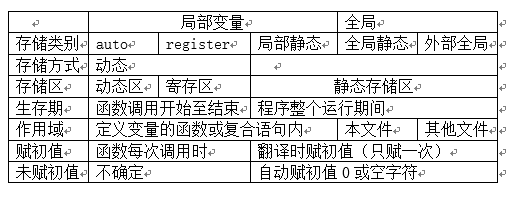

# 全局变量和局部变量
变量的作用域（scope）：变量起作用或有效的代码范围，空间。 

变量的生存期（life time）：变量存在的时间范围，时间。

根据变量的作用域将变量分为全局变量和局部变量 ：
    全局变量储存在静态数据区，局部变量在堆栈中。 
    
## 全局变量（global variable）： 
1. 作用域为它定义处开始到它的源文件结束为止，在某一个函数中改变会影响到其他函数，可以利用全局变量从被调函数中返回多个值。 
2. 生存期为整个程序运行期间，即程序启动时被创建，在程序运行结束时被销毁。 
3. 静态全局变量的作用域被限定在它所在的源文件中。 
4. 外部全局变量使用extern关键字声明，作用域扩到到其他源文件中。 

全局变量的缺点：维护困难，排错困难，代码复用困难。所以尽量少用。

## 局部变量(local wariable)： 
在函数体和代码块中定义的变量。 
 1. 作用域为它定义处开始到它的代码块结束为止 ，不同的函数可以定义同名变量。 
 2. 在被调用的时候才分配存储单元，离开函数后释放。 
 3. 所有形参都是局部变量，实参是主调函数中的局部变量。 
 4. 如果全局变量和局部变量同名，在局部变量的作用域范围内，全局变量将被屏蔽。

### 根据局部变量的生存期不同，又将局部变量分为：
 1. 普通（自动，auto）局部变量 （默认） 
 2. 静态（static）局部变量 占有永久性的存储单元（未赋初值默认为0），静态局部变量的生存区和全局变量相同。 
 3. 寄存器型（register） 无地址，不能求地址运算，大小必须能被CPU的寄存器接受。 

要注意的是这只是对操作系统的一种建议，并不是强制性命令，操作系统会根据当前寄存器的使用情况和自己的策略决定是否将该变量调到寄存器存放。有时不是寄存器变量也会调到寄存器中存放，所以在通常开发中寄存器变量没有很大意义。

一个工程中的所有普通全局变量不能同名，位于不同源文件中的静态全局变量名称可以相同。

# 函数的生存期和作用域： 
函数的生存期是整个程序运行期间 
根据作用域不同，函数分为普通（非静态）函数和静态函数 
 1. 普通函数的作用域是整个工程范围，即在一个工程中左右源文件中都可以调用 
 2. 静态函数的作用域是它所在的源文件，即只能在该函数所在的源文件中调用它 

static:内部函数，只能在所定义的源文件中被其他函数调用。 

extern:外部函数，可以被其他源文件中的函数调用，不指明存储类别的函数缺省为外部函数。

## 关键字static的作用： 
1. 在函数体，一个被声明为静态的变量在这一函数被调用过程中维持其值不变。 
2. 在模块内（但在函数体外），一个被声明为静态的变量可以被模块内所用函数访问，但不能被模块外其它函数访问。它是一个本地的全局变量。 
3. 在模块内，一个被声明为静态的函数只可被这一模块内的其它函数调用。那就是，这个函数被限制在声明它的模块的本地范围内使用。

# 小结： 
1. 数据的两种属性：数据类型和存储类别。 
2. 从作用域角度分，有局部变量和全局变量。 
    局部变量包括自动变量、静态局部变量(离开函数，变量值保留)、寄存器变量和形参； 
    全局变量分为静态全局变量（只能在本文件中使用）和非静态全局变量（其他文件可用）。 
3. 从函数生存期来分，有动态存储和静态存储。 
    动态存储包括自动变量、寄存器变量和形参； 
    静态存储分为静态全局变量（本文件）、静态局部变量（函数）和非静态全局变量（其他文件）。 
4. 从变量值存放的位置来区分，可分为静态和动态。 
    静态包括静态全局，静态局部，外部变量； 
    动态包括自动变量和形参。 

